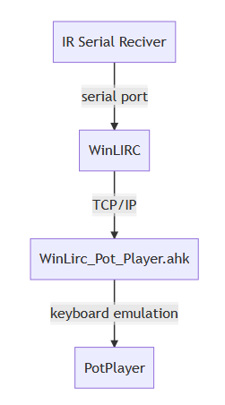

# WinLIRC Remote Control Scripts


# WinLIRC Client
This is the default WinLIRC Client, updated for working with Unicode version of AHK (https://www.autohotkey.com/) and any infrared receiver, I use a serial one, is very easy to build and use.

####Easy to build serial IR receiver


5 parts only !!! The sensor and the parts can easily be scavenged.
*Guide on how to build [HERE](http://web.archive.org/web/20061022051641/lnx.manoweb.com/lirc/?partType=section&partName=introduction).*

## How to install

• Install WinLIRC http://winlirc.sourceforge.net

*Guide on how to configure [HERE](http://winlirc.sourceforge.net/usageguide.html).*

• Install AutoHotKey https://www.autohotkey.com

• Install PotPlayer https://potplayer.daum.net

## Usage

• Start WinLIRC (configured already)
• Edit the [WinLirc_Pot_Player.ahk](WinLirc_Pot_Player.ahk)

1. Specify the path to WinLIRC executable and port number if you are using not the default one, the IP is changed if WinLIRC is on another machine that the script.
```autohotkey
; Specify the path to WinLIRC, such as C:\WinLIRC\winlirc.exe
WinLIRC_Path = C:\UTILS\WinLIRC\winlirc.exe

; Specify WinLIRC's address and port. The most common are 127.0.0.1 (localhost) and 8765.
WinLIRC_Address = 127.0.0.1
WinLIRC_Port = 8765
```
2. Specify the path to PotPlayer executable, it is needed for the custom icon in the tray
```autohotkey
; Set icon of script in tray same as PotPlayer
; Set FileName to target the PotPlayerExecutable
; 64-bit -> C:\Program Files\DAUM\PotPlayer\PotPlayerMini64.exe
; 32-bit -> C:\Program Files (x86)\DAUM\PotPlayer\PotPlayerMini.exe
FileName := "C:\Program Files\DAUM\PotPlayer\PotPlayerMini64.exe"
```
3. Now choose what buttons of your remote, i use a Technisat remote see the config file [MyTechnisat.cf](WinLIRC/MyTechnisat.cf), and edit the script

```autohotkey
; --------------------------------------------
; ASSIGN ACTIONS TO THE BUTTONS ON YOUR REMOTE
; --------------------------------------------
; Configure your remote control's buttons below. Use WinLIRC's names
; for the buttons, which can be seen in your WinLIRC config file
; (.cf file) -- or you can press any button on your remote and the
; script will briefly display the button's name in a small window.
; 
; Below are some examples. Feel free to revise or delete them to suit
; your preferences.


OK: ; <-- This is the label from the winlirc configuration file, that coresponds to the designated key on the remote
IfWinExist, PotPlayer ; <-- "PotPlayer" is the window name of our app
{
	WinActivate, PotPlayer ; <-- "PotPlayer" is the window name of our app
	WinGetPos, X, Y, Width, Height, PotPlayer ; <-- "PotPlayer" is the window name of our app
	Send {space} ; sendink skeyboard event space to trigger the specific function of the app 
	guidisp("Play Pause",X, Y) ; gui feedback 
}
else ; if app not running execute code, in this case gui disp on main screen (the one with * in windows settings)
{
	guidisp("Pot Player NOT running",0, 0)
}
return ; <-- end of function
```

Function diagram:



